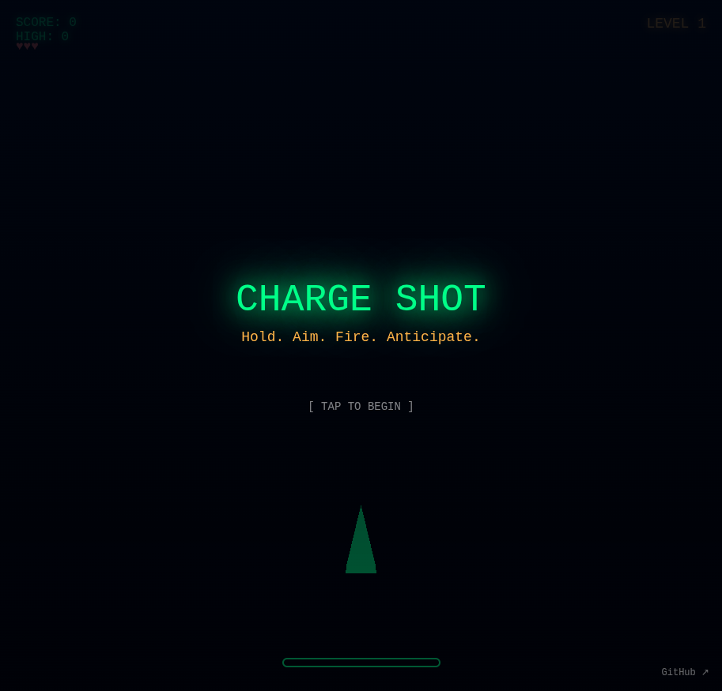

# Charge Shot

Hold. Aim. Fire. Anticipate.

A space shooter where you charge a beam weapon by holding anywhere on screen. The beam's power matches your charge level — match it to the enemy formation density to destroy them all. Formations shift while you charge, so anticipate their movement, don't just react.

## How to Play

- **Hold** anywhere on screen to charge your beam
- **Release** to fire — beam width matches charge level
- Match beam width to formation density:
  - Tight clusters = low charge (narrow beam)
  - Spread formations = high charge (wide beam)
- Clear all 5 levels to win
- Don't let formations reach your ship!

## Built With

- [Three.js r183](https://threejs.org/)
- [Tone.js v15.1.22](https://tonejs.github.io/)

## Links

- **Play:** https://nishivector.github.io/charge-shot/
- **Repo:** https://github.com/nishivector/charge-shot
